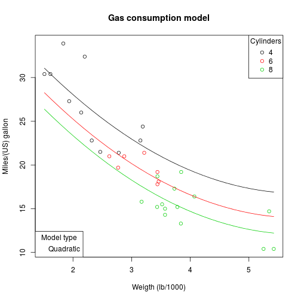

## Introduction

The goal of this model is computing a gas consumption estimate using only two
variables, one qualitative and one quantitative.
The shiny app computes a linear model based on these variables.
The model is computed with data from the mtcars dataset fron the datasets R package.

Quantitative:
* Weight (lb/1000)
* Displacement (cu.in.)
* Gross horsepower

Qualitative:
* Number of cylinders
* Transmission type
* Number of forward gears

--- .class #id 

## Model selection

Chossing two mentioned variables and the degree of the polynom built with 
quantitive variable a linear model is computed. Lets assume weight, cylinders and quadratic model are selected. The model will perform the following computation:


```r
modelFit <- lm( mpg ~ as.factor(cyl) + poly(wt, degree = 2), data = mtcars)
```

--- .class #id

## Visualization

A plot of selected model is included to help choosing between different model based on exploratory analysis.

 


--- .class #id

## Input values and results
Finally inputing the values for selected variables will compute gas consumption
estimate and also adjusted R-squared to assess goodness of computed model. 


```r
format(predict(modelFit, newdata = data.frame(wt = 2, cyl = "6")), digits = 1, nsmall = 2)
```

```
##       1 
## "25.24"
```

```r
format(summary(modelFit)$adj.r.squared, digits =1, nsmall = 3)
```

```
## [1] "0.837"
```


